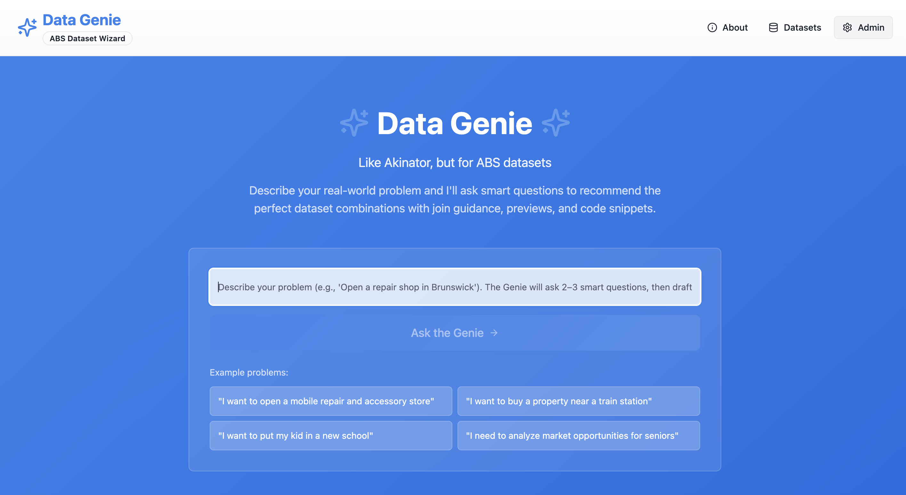
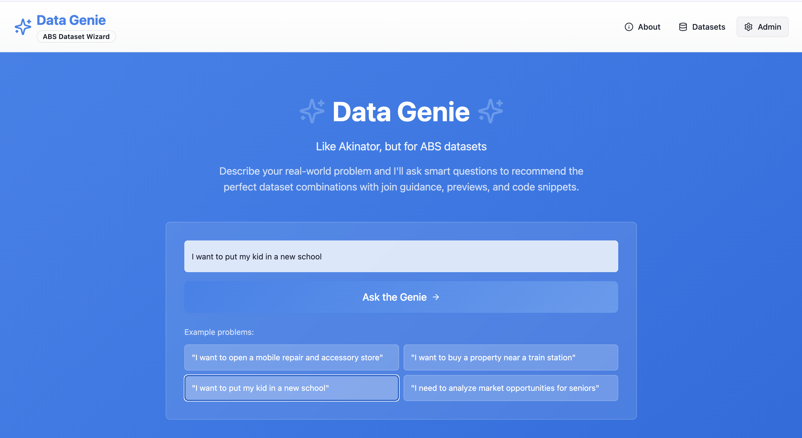
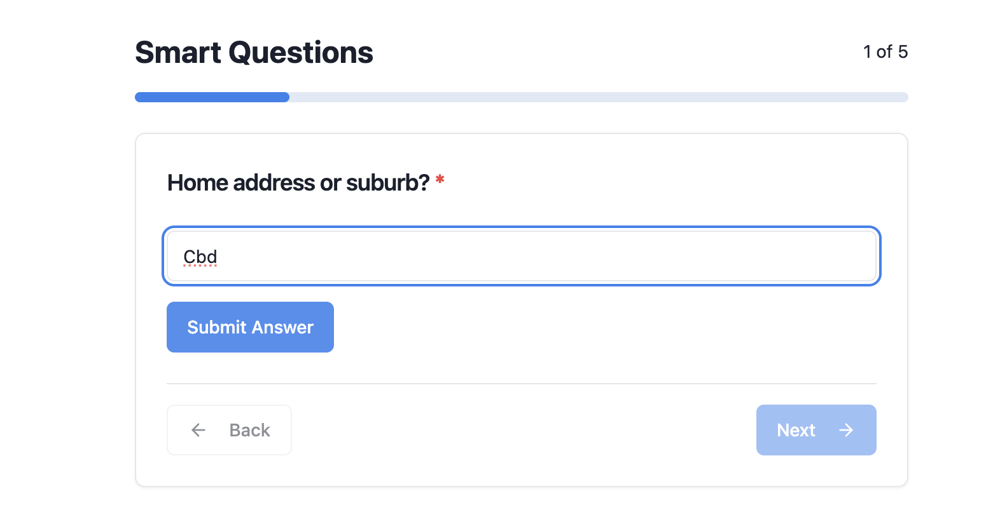
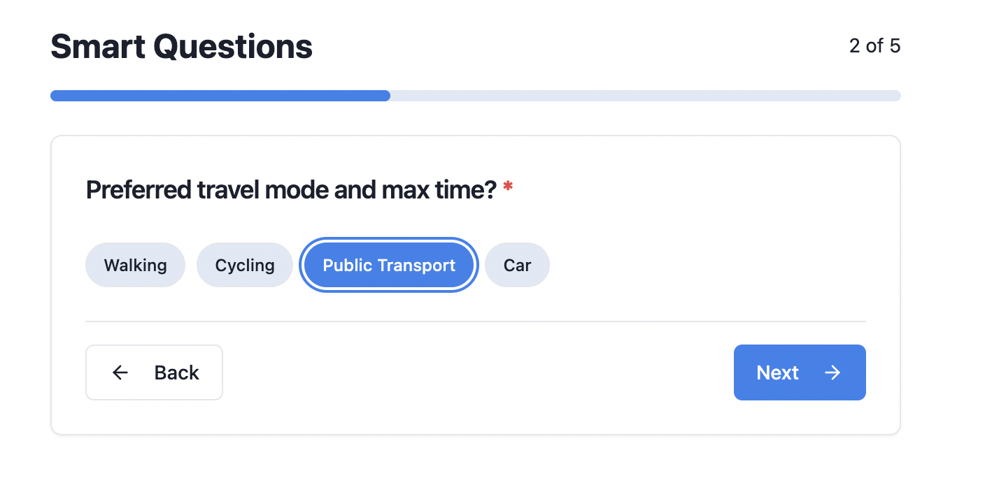
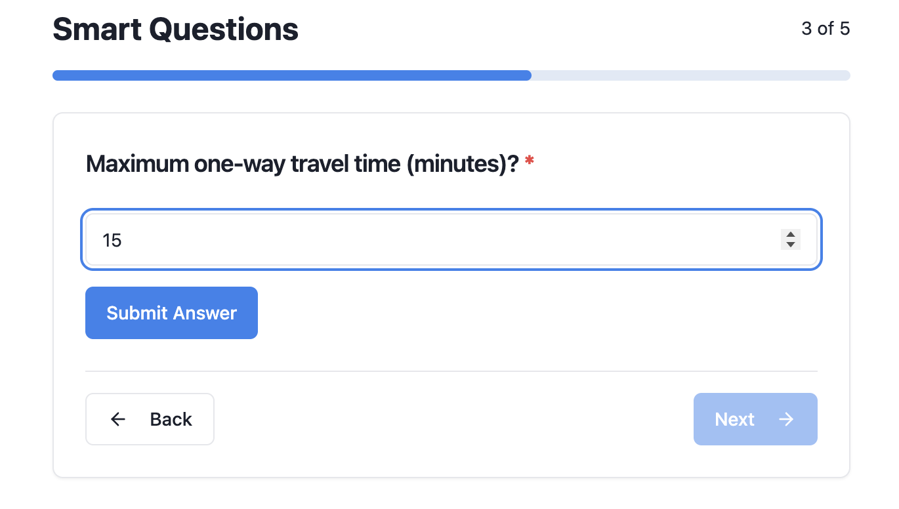
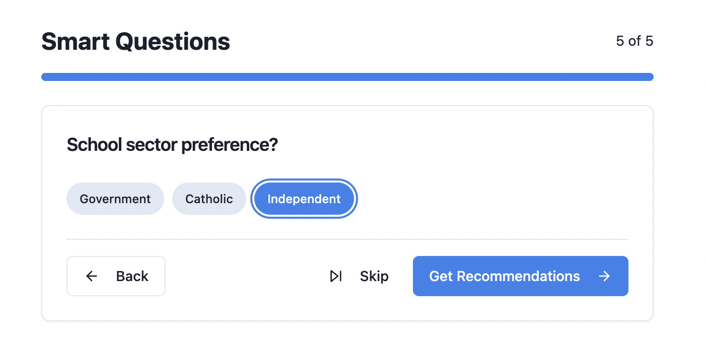
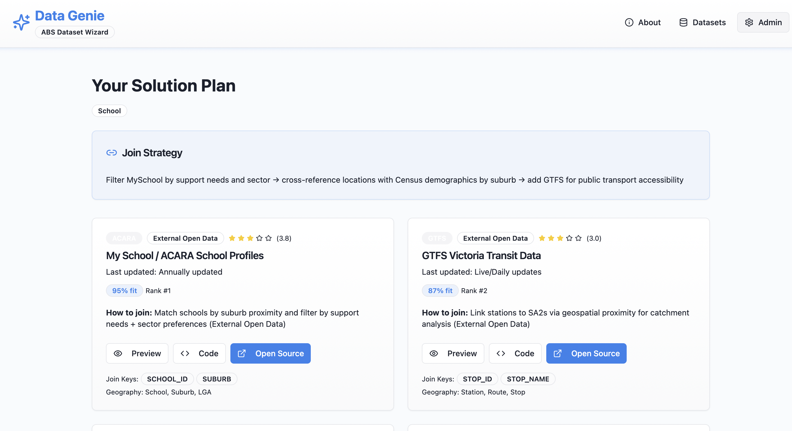
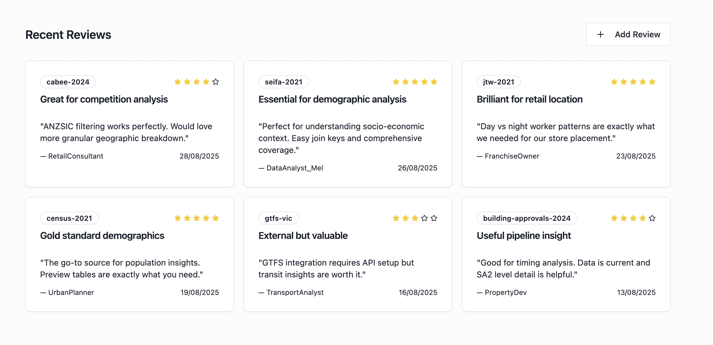
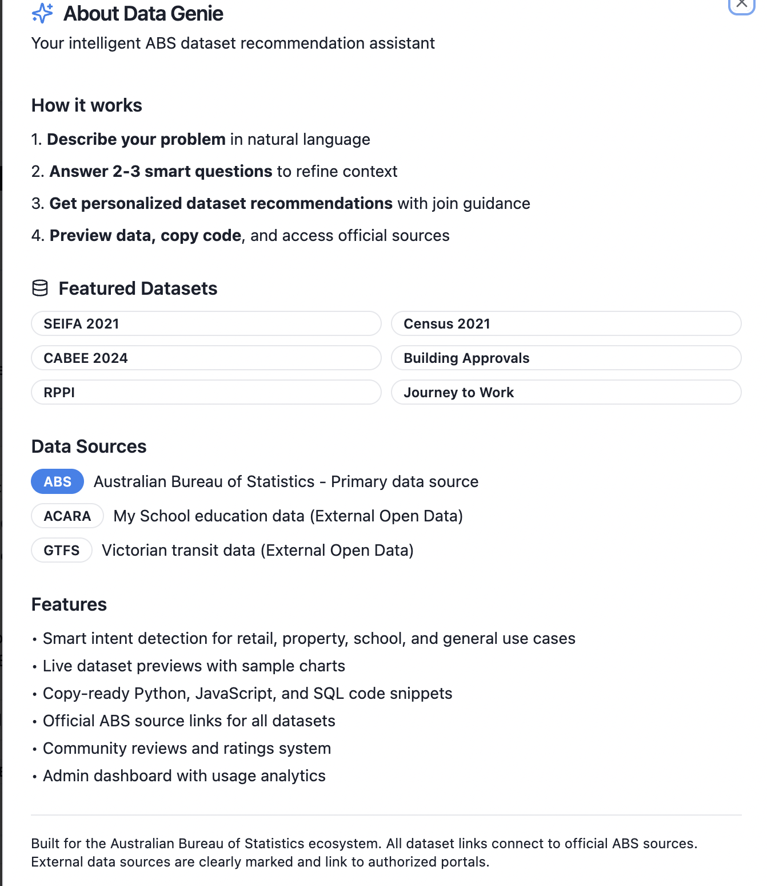
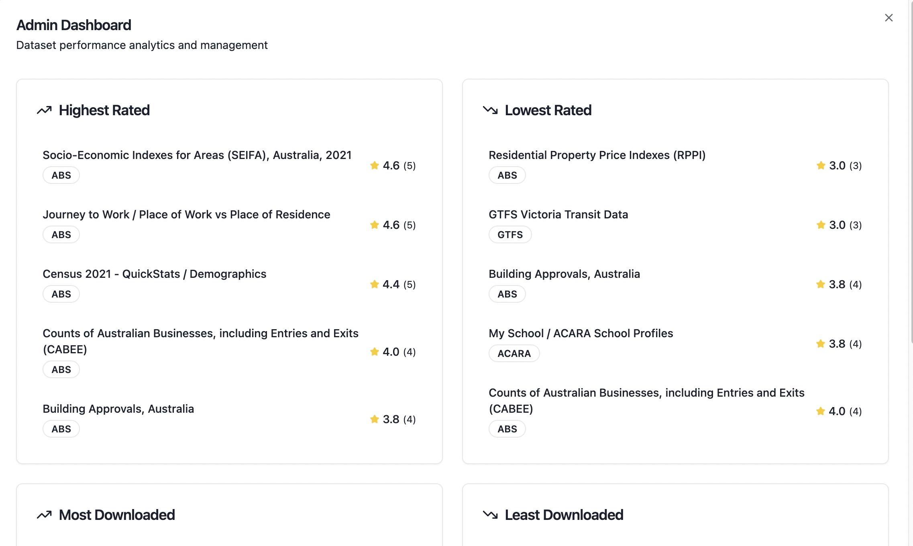

# **Data Genie – ABS Dataset Wizard 🧞‍♂️**

*GovHack 2025 – Navigating Australia’s Data Landscape*

Data Genie is an intelligent assistant that helps users instantly find the **right Australian government datasets** for their real-world questions.
Users describe a problem → answer 2–3 smart questions → get a personalised dataset “solution plan” with metadata, join strategies, and ready-to-run code.

Built with:

* **Vite**
* **React (TypeScript)**
* **shadcn-ui**
* **Tailwind CSS**

---

## 📸 **Screenshots**

> Place the screenshot PNGs inside:

```
public/screenshots/
```

### **Smart Questions Flow**

#### 1. Home/Suburb Input



#### 2. Landing Page – Problem Input



#### 3. Landing Page – Helper Placeholder



#### 4. Travel Mode



#### 5. Max Travel Time



#### 6. School Sector



---

### **Solution Plan & Community**

#### 7. Dataset Solution Plan



#### 8. Success Stories


#### 9. Community Reviews



#### 10. About Panel



---

### **🛠️ Admin Dashboard (NEW)**



---

## 🎯 **Why Data Genie?**

Australia’s government data is powerful but difficult to navigate:

* Different agencies host different datasets
* Metadata is inconsistent
* Users “don’t know what they don’t know”
* Trial-and-error is needed to combine datasets

**Data Genie solves this with a single unified interface**, focusing on ABS first, but including external agencies (ACARA, GTFS, etc.).

---

## ✨ **Key Features**

### 🔍 Natural Language Querying

Describe your question in plain English (e.g., *“Find a school with good EAL/D support near Melbourne CBD”*).

### ❓ Smart-Question Wizard

Asks 2–5 clarifying questions, such as:

* Location
* Travel mode
* Max commute time
* Sector preferences

### 🧩 AI-Assisted Dataset Matching

The solution plan includes:

* Ranked datasets with *fit% score*
* Metadata (custodian, update frequency)
* Join keys (e.g., `SA2`, `SCHOOL_ID`, `STOP_ID`)
* Preview data tables
* API/download links
* Code snippets (Python, JS, SQL)

### 👥 Community Layer

* Success stories
* Dataset reviews
* Notebook sharing
* Rating system

### 📊 Admin Dashboard

Shows dataset performance analytics:

* Highest rated
* Lowest rated
* Most downloaded
* Least downloaded

---

## 🔗 **Data Sources**

### **ABS (Primary Source)**

* Census 2021
* SEIFA 2021
* JTW
* Building Approvals
* RPPI

### **External Open Data**

* ACARA MySchool
* GTFS VIC Transit

Each dataset includes custodian, lineage, and access method.

---

## ⚙️ **How It Works**

1. User submits natural language problem
2. Intent detection → domain classification
3. Smart Questions refine details
4. Dataset scoring engine ranks relevant datasets
5. App generates an explainable **Join Strategy**
6. User receives a full **Solution Plan**

---

## 🛠️ **Tech Stack**

* **React + TypeScript**
* **Vite**
* **Tailwind CSS**
* **shadcn-ui**
* **lucide-react** icons

---

## 🚀 Getting Started

### 1. Clone the repo

```bash
git clone <your-repo-url>
cd data-genie
```

### 2. Install dependencies

```bash
npm install
```

### 3. Run locally

```bash
npm run dev
```

### 4. Build

```bash
npm run build
npm run preview
```

---

## 📁 Project Structure

*(Matches your actual GitHub files)*

```
public/
  screenshots/   ← Add screenshots here
src/
  components/
  pages/
  lib/
  App.tsx
  main.tsx
index.html
package.json
tailwind.config.ts
vite.config.ts
tsconfig.json
```

---

## 🌱 Future Enhancements

* Full integration with ABS Data API
* Auto-discovery of datasets across agencies
* Versioned dataset lineage viewer
* Exportable analysis pipelines
* User accounts + saved solution plans

---

## 🙏 Acknowledgements

* Built for **GovHack 2025 – Navigating Australia’s Data Landscape**
* Uses open metadata from ABS, ACARA, and GTFS VIC
* Not an official ABS product — purely a demo prototype

---
